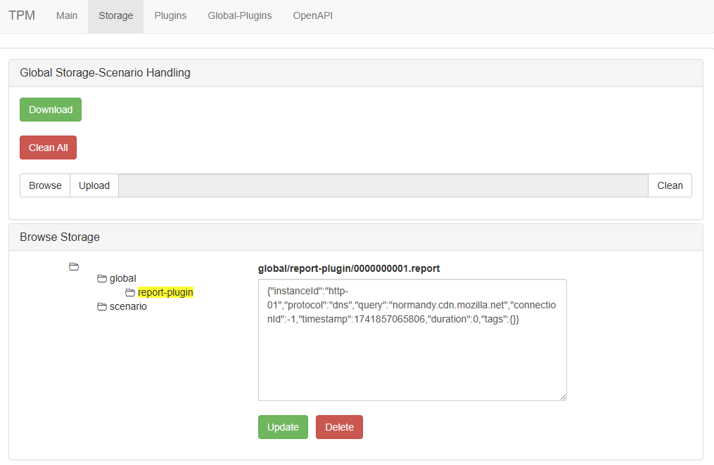
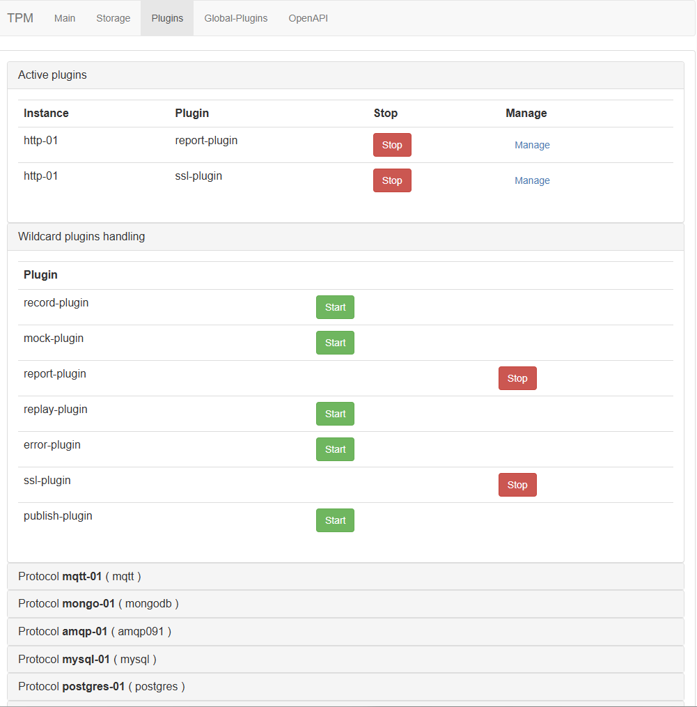
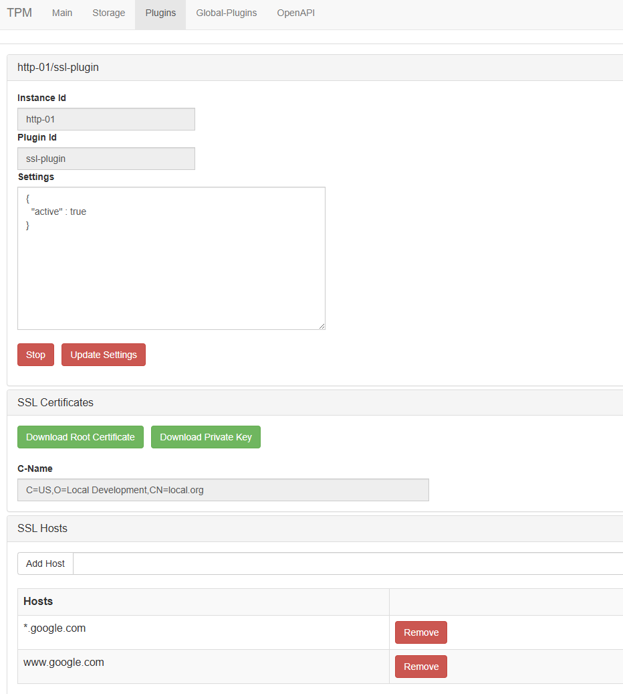

## The Protocol Master UI

### Main tab

Here you can

* Restart the application
* Terminate the application
* Download the current settings (complete with the modifications you applied)
* See the API port
* The directory where all data is stored
* Where the plugins are located
*

### Storage tab

Here you can

* Download the current solution (included the settings) that will allow when uploaded to create exactly the scenario on
  which you where working
* Clear all recorded data
* Upload a new scenario
* Browse all the data present in the application

* Modify all files present in the application

### Plugins tab

* Check (and stop eventually) the active plugins
* Start and stop plugin in batch (`wildcard`) for example to start recording and replaying on all protocols

* See/start/stop/manage all plugins for a given protocol

* Manage all the settings for a specific plugin (i am adding all the functionalities as soon as they are requested or
  prioritized)

### Global plugins tab

* Manage with the same approach the global plugins

### The special report plugin

All the parts of TPM creates `report events` that are stored by the global report plugin

You can query all data with the [tpmql](tpmql.md) query language. It allows you to filter the
data and support advanced filtering and projection scenarios

Here whe are selecting from the report data all POST requests and showing their
characteristics selecting only some field and ordering by date

`
SELECT(
    WHAT(date=MSTODATE(timestamp),instanceId,protocol,
        query=SUBSTR(query,50),duration,tags=WRAP(tags,50,' ')),
    WHERE(tags.method=='POST'),
    ORDERBY(DESC(date))
)
`

### Some useful query

Find all dns calls

`SELECT(
    WHAT(date=MSTODATE(timestamp),instanceId,protocol,query),
    WHERE(protocol=='dns'),
    ORDERBY(DESC(date))
)`

Find all grouped DNS calls

`SELECT(
    WHAT(cnt=COUNT(),rd=tags.requestedDomain),
GROUPBY(tags.requestedDomain),
ORDERBY(DESC(cnt))
)`

Find all calls to specific host

`SELECT(
  WHAT(date=MSTODATE(timestamp),instanceId,protocol,
  tags.method,
  query=SUBSTR(query,50),duration,tags=WRAP(tags,50,' ')),
  WHERE(tags.host=='HOST_TO_SEARCH_FOR'),
  ORDERBY(DESC(date))
)`

### Send data to queues

For amqp, mqtt and redis you can send data directly via the UI

